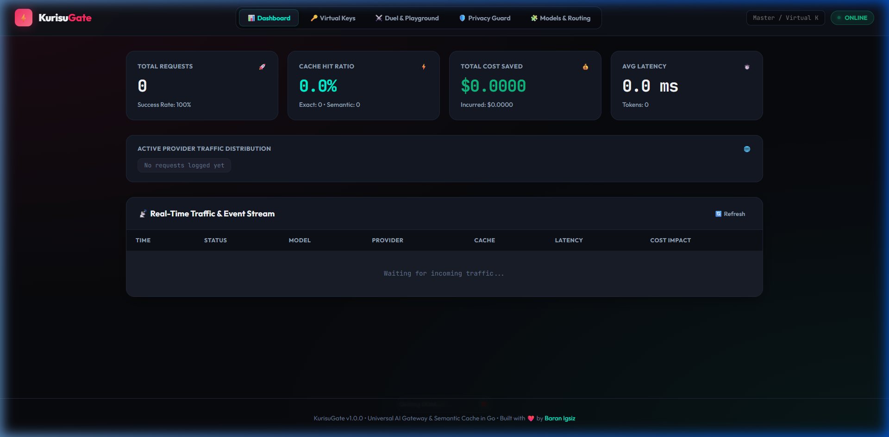
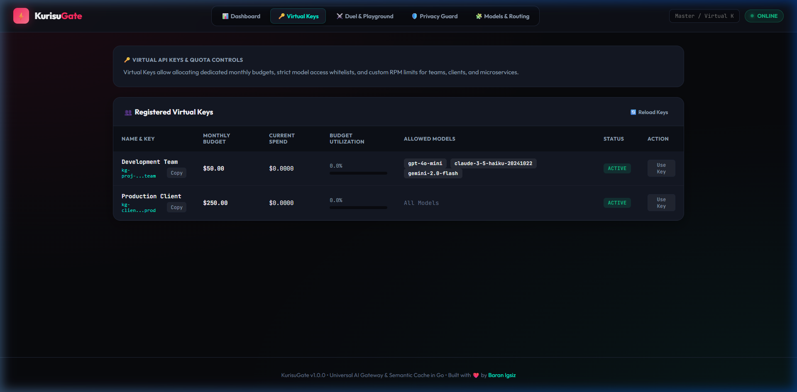
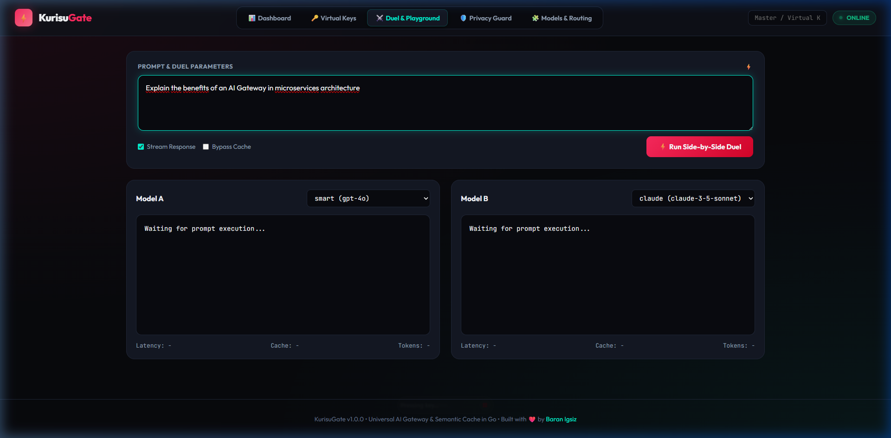
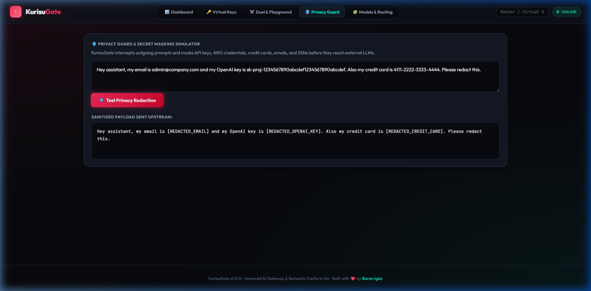

<div align="center">

<pre align="center">
  _  __  _   _   ____    ___   ____    _   _    ____      _      _____   _____ 
 | |/ / | | | | |  _ \  |_ _| / ___|  | | | |  / ___|    / \    |_   _| | ____|
 | ' /  | | | | | |_) |  | |  \___ \  | | | | | |  _    / _ \     | |   |  _|  
 | . \  | |_| | |  _ <   | |   ___) | | |_| | | |_| |  / ___ \    | |   | |___ 
 |_|\_\  \___/  |_| \_\ |___| |____/   \___/   \____| /_/   \_\   |_|   |_____|
</pre>

# ⚡ KurisuGate (クリス)
### Universal AI Gateway, Semantic Cache & Multi-Model Proxy in Go

[](https://github.com/Baranigsiz/KurisuGate/releases)
[](https://github.com/Baranigsiz/KurisuGate/actions)
[](https://pkg.go.dev/github.com/Baranigsiz/KurisuGate)
[](https://golang.org/)
[](https://opensource.org/licenses/MIT)
[]()
[]()

**KurisuGate (クリス)** is an ultra-fast, zero-dependency Universal AI Gateway and Reverse Proxy built in Go. It acts as a single, drop-in replacement for OpenAI endpoints (`/v1/chat/completions`, `/v1/embeddings`, `/v1/models`) bridging **OpenAI, Anthropic Claude, Google Gemini, DeepSeek (V3/R1), Groq, Mistral, xAI (Grok), Together AI, Perplexity, Cohere, OpenRouter, and local Ollama/vLLM** behind a unified interface with **Virtual API Keys & Budget Quotas, Dual-Tier Semantic Caching with Persistent Disk Snapshots, Weighted Load Balancing, Prompt Compression, PII Privacy Guard, an Embedded Cyberpunk Web UI Dashboard, and a real-time Charm TUI**.

[Features](#-key-features) • [Architecture](#-architecture) • [Benchmarks](#-benchmarks) • [Quick Start](#-quick-start) • [Web UI & Dashboard](#-embedded-web-ui--playground) • [Configuration](#-configuration) • [SDK Integration](#-drop-in-sdk-integration)

---

</div>

## 🌟 Key Features

* 🌐 **12+ Major LLM Providers Supported:** Drop-in bridge for **OpenAI, Anthropic Claude, Google Gemini, DeepSeek, Groq, Mistral, xAI (Grok), Together AI, Perplexity, Cohere, OpenRouter, and local Ollama/vLLM** with zero external dependencies.
* 🔑 **Virtual API Keys & Monthly Budget Quotas:** Create scoped virtual keys for teams or clients with monthly spending limits (e.g. `$50.00/mo`), strict allowed model whitelists, and per-key rate limiting.
* ⚖️ **Weighted Provider Load Balancing & A/B Routing:** Split incoming traffic across providers with weighted distribution (e.g. 70% DeepSeek, 30% OpenAI) or smart dynamic routing (`cheapest`, `fastest`).
* ⚡ **Sub-Millisecond Dual-Tier Caching with Disk Persistence:**
  * **Tier 1 (Exact LRU Cache):** Deterministic SHA-256 hash lookup with zero memory allocations (`< 22 ns` lookup time, **52M+ ops/sec**).
  * **Tier 2 (Zero-Cost Local Semantic Cache):** In-memory Cosine Similarity search over prompt embeddings with built-in zero-dependency N-gram vectorizer. Slashes API bills by up to **80%**.
  * **Atomic Disk Snapshots:** Automatic periodic persistence and graceful shutdown restore to prevent cache loss on container restart.
* 🛡️ **Resilient Multi-Model Fallback (Circuit Breaker):** If your primary provider throws `429 Too Many Requests`, `500 Internal Server Error`, or times out, KurisuGate automatically fails over down your configured fallback chain without failing the client request.
* 🗜️ **Prompt & Context Sıkıştırma (Token Compressor):** Removes redundant whitespace, deduplicates newlines, and fits conversations into sliding context windows to preserve tokens and lower latency.
* 🔒 **PII & Secret Redaction Guard:** Automatically intercepts and redacts sensitive data (API keys `sk-...`, AWS credentials, credit card numbers with Luhn check, emails, SSNs, passwords) before prompts reach external AI servers.
* 🩹 **Auto JSON Repair & Markdown Cleaner:** Automatically strips markdown code fences (` ```json `) and fixes trailing commas/broken brackets when clients request structured JSON output.
* ⚖️ **Multi-Key Load Balancing Pool:** Distribute traffic across multiple API keys per provider using Round-Robin and automatic 429 cooldowns.
* 🌐 **Embedded Cyberpunk Web UI & Live Playground (`/ui`):** Zero-dependency Web UI embedded directly into the Go binary (`embed.FS`) featuring live traffic analytics, virtual keys budget visualizer, and a real-time SSE "Model Duel" playground.
* 📊 **Prometheus & OpenTelemetry Exporter (`/metrics`):** Production-ready Grafana/Prometheus metrics endpoint.

---

## 🏛️ Architecture

```text
                                  +---------------------------------------+
                                  |   Client App / SDK / LangChain / IDE  |
                                  +-------------------+-------------------+
                                                      | (OpenAI v1 Protocol)
                                                      v
                                  +---------------------------------------+
                                  |         KurisuGate HTTP Proxy         |
                                  |   [Auth • RateLimiter • CORS • SSE]   |
                                  +-------------------+-------------------+
                                                      |
                                            [PII Guard & Compressor]
                                                      |
                          +---------------------------+---------------------------+
                          |                                                       |
                          v (Exact & Semantic Cache)                              v (Cache Miss)
              +-----------------------+                               +-----------------------+
              |   Dual-Tier Cache     |                               |   Router & Failover   |
              | Exact (SHA256 LRU)    |                               |    Circuit Breaker    |
              | Semantic (Cosine Sim) |                               +-----------+-----------+
              +-----------+-----------+                                           |
                          |                               +-----------------------+-----------------------+
                          | (Sub-ms Hit)                  |                       |                       |
                          |                               v                       v                       v
                          |                      +----------------+      +----------------+      +----------------+
                          |                      | OpenAI / Groq  |      | Anthropic      |      | Google Gemini  |
                          |                      | (Direct Pass)  |      | (SSE Translate)|      | (SSE Translate)|
                          +--------------------->+----------------+      +----------------+      +----------------+
                                                                                  |                       |
                                                                                  v                       v
                                                                         +----------------+      +----------------+
                                                                         | Ollama (Local) |      | DeepSeek / vLLM|
                                                                         +----------------+      +----------------+
```

---

## ⚡ Benchmarks

Benchmarked on **AMD Ryzen 5 5600X (6-Core, 12-Threads)** with `go test -bench=. -benchmem`:

| Benchmark Scenario | Operations/sec | Latency (ns/op) | Memory Allocated | Allocations |
|---|---|---|---|---|
| **Exact Cache Lookup (`Get`)** | **52,609,196 ops/s** | **21.97 ns** | `0 B/op` | `0 allocs` |
| **Request SHA-256 Hashing** | **1,399,593 ops/s** | **870.4 ns** | `464 B/op` | `4 allocs` |
| **Cosine Similarity (1536-dim)** | **1,000,000 ops/s** | **1.13 µs** | `0 B/op` | `0 allocs` |
| **Full HTTP Proxy (Cached Hit)** | **113,095 req/s** | **12.8 µs** | `5.8 KB/op` | `56 allocs` |

> 🚀 **Over 52 Million cache lookups per second** and sub-15 microsecond full HTTP round-trips for cached responses!

---

## 💡 How It Works & Execution Modes

KurisuGate operates in two seamless modes depending on your environment:

### 🎮 Mode 1: Instant Simulation & Playground Mode (Zero-Config Demo)
* **When it activates:** When you clone and run KurisuGate without configuring any cloud API keys.
* **What it does:** KurisuGate automatically engages its internal, zero-dependency **Simulation Engine**. You can launch the Web Dashboard (`http://localhost:8080/ui`), enter prompts in the **Side-by-Side Model Duel**, test live SSE token streaming, inspect PII redaction, and watch real-time cache hits and latency sparklines immediately without creating cloud accounts or entering credit cards.

### 🚀 Mode 2: Enterprise Production Mode (Live LLMs & Cache Savings)
* **When it activates:** As soon as you configure one or more real provider API keys in `kurisu.yaml` or environment variables:
  ```bash
  export OPENAI_API_KEY="sk-proj-..."
  export GEMINI_API_KEY="AIzaSy..."
  export ANTHROPIC_API_KEY="sk-ant-..."
  ```
* **What it does:** KurisuGate acts as an enterprise-grade intelligent reverse proxy for your apps (Cursor, LangChain, Next.js, Python apps). It intercepts requests, masks sensitive secrets, checks exact and semantic caches for sub-millisecond instant hits (slashing API bills by 40-80%), enforces virtual key monthly budgets, and automatically fails over across models if an upstream provider experiences outages or rate limits.

---

## 🚀 Quick Start

### 1. Run with Docker Compose (Recommended)

```bash
# Clone the repository
git clone https://github.com/Baranigsiz/KurisuGate.git
cd KurisuGate

# Start KurisuGate with persistent cache volume
docker compose up -d

# (Optional) Start with local Ollama service enabled
docker compose --profile ollama up -d
```

### 2. Run with Docker Single Container

```bash
docker run -d -p 8080:8080 \
  -v ./data:/app/data \
  -e OPENAI_API_KEY="your-openai-key" \
  -e ANTHROPIC_API_KEY="your-anthropic-key" \
  -e GEMINI_API_KEY="your-gemini-key" \
  baranigsiz/kurisugate:latest
```

### 3. Run Binary Locally

```bash
# Build binary
go build -o kurisugate.exe ./cmd/kurisu

# Start KurisuGate gateway (opens on http://0.0.0.0:8080)
./kurisugate start

# Access the embedded Web UI in your browser:
# http://localhost:8080/ui
```

---

## 🌐 Embedded Web UI & Dashboard

KurisuGate includes a zero-dependency, cyberpunk-inspired Web UI embedded directly into the Go binary (`http://localhost:8080/ui`):

<div align="center">

### 📊 Real-Time Analytics Dashboard


### 🔑 Virtual API Keys & Budget Quotas


<p align="center">
  
  
</p>

</div>

* 📊 **Live Analytics:** Real-time throughput, cache hit ratios, latency graphs, and total dollar cost savings.
* 🔑 **Virtual Keys Manager:** Live monitoring of virtual keys, monthly spend, and dynamic budget utilization progress bars.
* ⚔️ **Side-by-Side Model Duel:** Send identical prompts to Model A (e.g. `gpt-4o`) and Model B (e.g. `claude-3-5-sonnet`) simultaneously with live SSE token streaming.
* 🛡️ **Interactive Privacy Tester:** Test regex PII and API secret masking.

---

## ⚙️ Configuration (`config.yaml`)

```yaml
server:
  host: "0.0.0.0"
  port: 8080
  master_keys:
    - "sk-kurisu-local-master-key"
  virtual_keys:
    - key: "kg-dev-team"
      name: "Development Team"
      monthly_budget_usd: 50.0
      allowed_models: ["gpt-4o-mini", "gemini-2.0-flash"]
      enabled: true

cache:
  exact:
    enabled: true
    max_entries: 10000
    ttl_seconds: 3600
  semantic:
    enabled: true
    similarity_threshold: 0.90
    embedding_provider: "local"
  persistence:
    enabled: true
    file_path: "./data/kurisu_cache.json"

guard:
  enabled: true
  mask_secrets: true
  mask_emails: true
  mask_cards: true
  auto_json_repair: true
  prompt_compression:
    enabled: true
    max_context_messages: 50

providers:
  openai:
    enabled: true
    api_key: "${OPENAI_API_KEY}"
  anthropic:
    enabled: true
    api_key: "${ANTHROPIC_API_KEY}"
  gemini:
    enabled: true
    api_key: "${GEMINI_API_KEY}"
  ollama:
    enabled: true
    base_url: "http://localhost:11434"

routing:
  model_aliases:
    "fast": "gpt-4o-mini"
    "smart": "gpt-4o"
    "claude": "claude-3-5-sonnet-20241022"
    "gemini": "gemini-2.0-flash"
    "local": "llama3.2"

  weighted_targets:
    "hybrid-chat":
      - provider: "deepseek"
        model: "deepseek-chat"
        weight: 70
      - provider: "openai"
        model: "gpt-4o-mini"
        weight: 30

  fallback_chains:
    "gpt-4o":
      - "claude-3-5-sonnet-20241022"
      - "gemini-2.0-flash"
      - "llama3.2"
```

---

## 📡 REST API Reference

| Endpoint | Method | Description |
|---|---|---|
| `/v1/chat/completions` | `POST` | OpenAI-compatible chat completions with caching, PII redaction, and fallback |
| `/v1/embeddings` | `POST` | OpenAI-compatible embeddings generation endpoint |
| `/v1/models` | `GET` | Lists all aggregated models across configured providers |
| `/api/virtual-keys` | `GET` | List all registered virtual keys, spending, and budgets |
| `/api/virtual-keys` | `POST` | Create a new virtual key (`name`, `monthly_budget_usd`, `allowed_models`) |
| `/api/virtual-keys` | `DELETE` | Revoke a virtual key by key token (`?key=kg-...`) |
| `/api/cache/purge` | `POST` | Immediately flushes all Exact LRU and Semantic Vector caches |
| `/health` | `GET` | Gateway health check and uptime status |
| `/stats` | `GET` | Real-time traffic metrics, cache hit ratio, and dollar savings |
| `/metrics` | `GET` | Prometheus / OpenTelemetry telemetry scrape endpoint |
| `/ui` | `GET` | Embedded Cyberpunk Web UI Dashboard & Model Duel Playground |

---

## 💻 Drop-in SDK Integration

### Python (`openai`)
```python
from openai import OpenAI

client = OpenAI(
    base_url="http://localhost:8080/v1",
    api_key="sk-kurisu-local-master-key",
)

# 1. Non-streaming with automatic fallback
response = client.chat.completions.create(
    model="smart", # Resolves to gpt-4o with failover
    messages=[{"role": "user", "content": "Explain quantum computing in one sentence."}],
)
print(response.choices[0].message.content)

# 2. Streaming Claude 3.5 Sonnet through OpenAI client
stream = client.chat.completions.create(
    model="claude-3-5-sonnet-20241022",
    messages=[{"role": "user", "content": "Write a haiku about servers."}],
    stream=True,
)
for chunk in stream:
    if chunk.choices[0].delta.content:
        print(chunk.choices[0].delta.content, end="", flush=True)
```

### TypeScript / Node.js
```typescript
import OpenAI from "openai";

const openai = new OpenAI({
  baseURL: "http://localhost:8080/v1",
  apiKey: "kg-dev-team", // Using a Virtual Key with $50 budget limit
});

const response = await openai.chat.completions.create({
  model: "fast",
  messages: [{ role: "user", content: "Hello KurisuGate!" }],
});
console.log(response.choices[0].message.content);
```

---

## 🧪 Testing & Validation

```bash
# Run all 22 unit tests with race detector
go test -v -race ./tests

# Run micro-benchmarks
go test -bench=. -benchmem ./benchmarks
```

---

## 📄 License

Distributed under the **MIT License**. See [`LICENSE`](LICENSE) for details.

<div align="center">
  <sub>Built with ❤️ by <a href="https://github.com/Baranigsiz">Baran Igsiz</a>.</sub>
</div>
